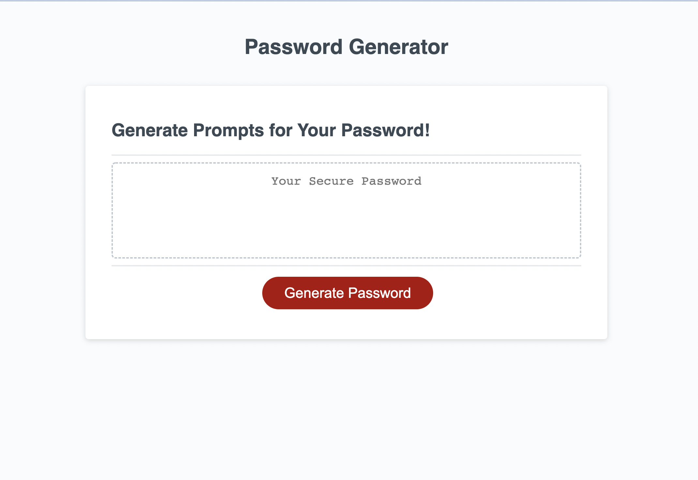
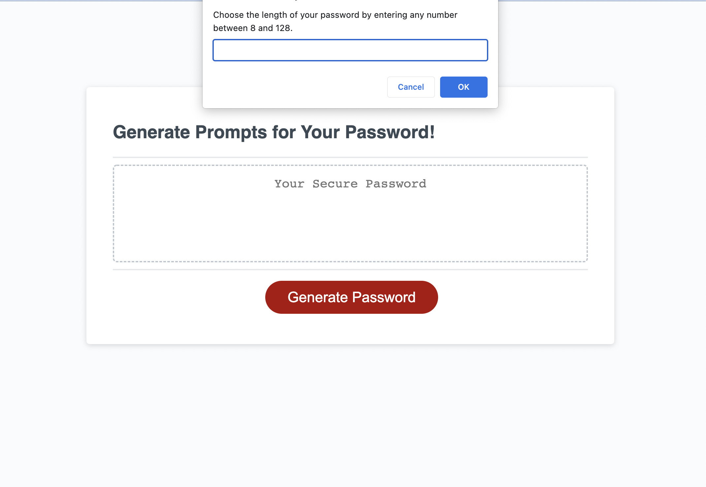
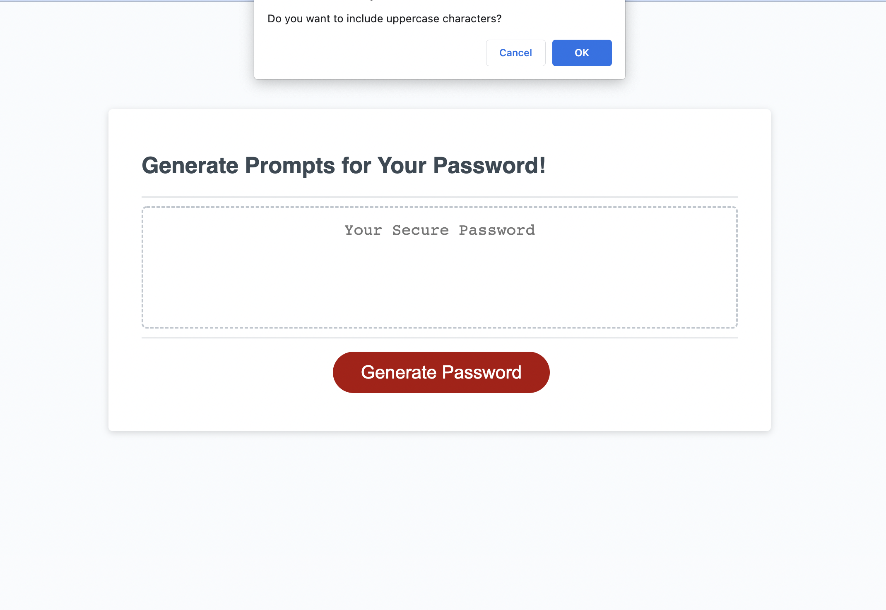
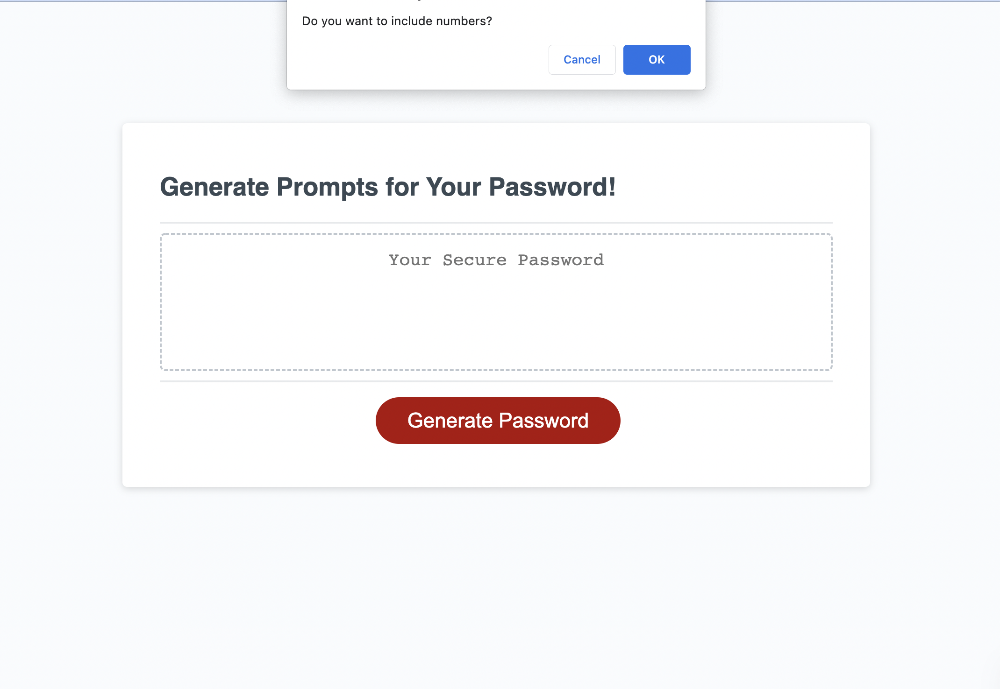
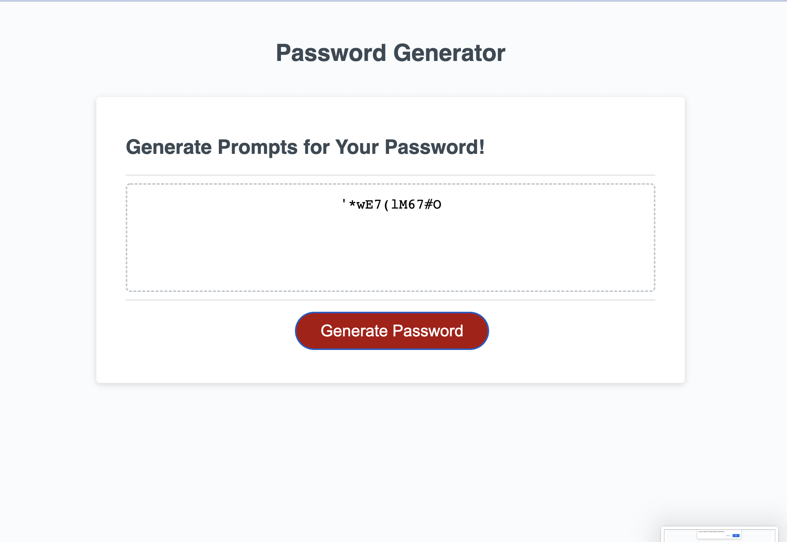

# Password-Generator

## Description

A Javascript Challenge provided by GT Bootcamp. In essence, this project helped me further develop my skills in Javascript. By using conditionals, I was able to successfully get the starter code provided to be up and running. I learned how to write conditionals even better as well as utilizing the full extent of asciiCode. 

## Usage

Live Website:

https://hafeezarif.github.io/Password-Generator/ 

